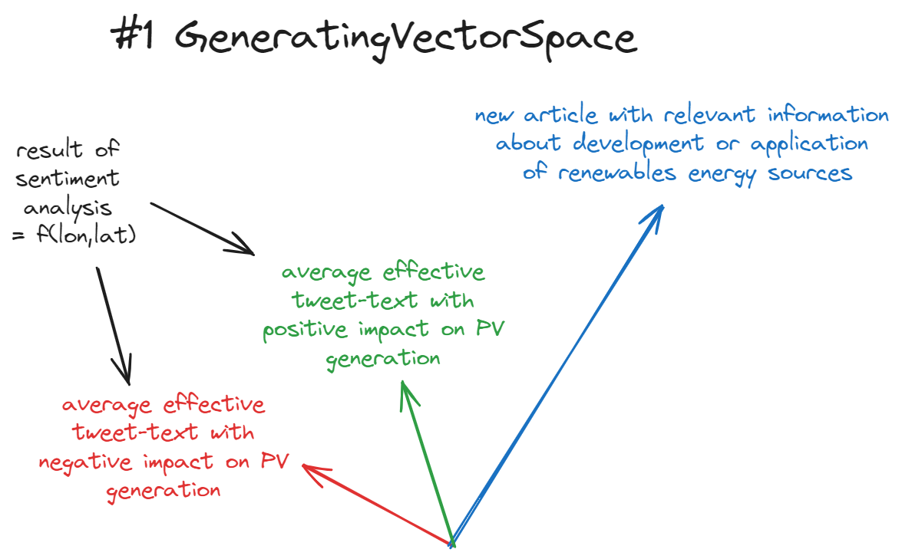
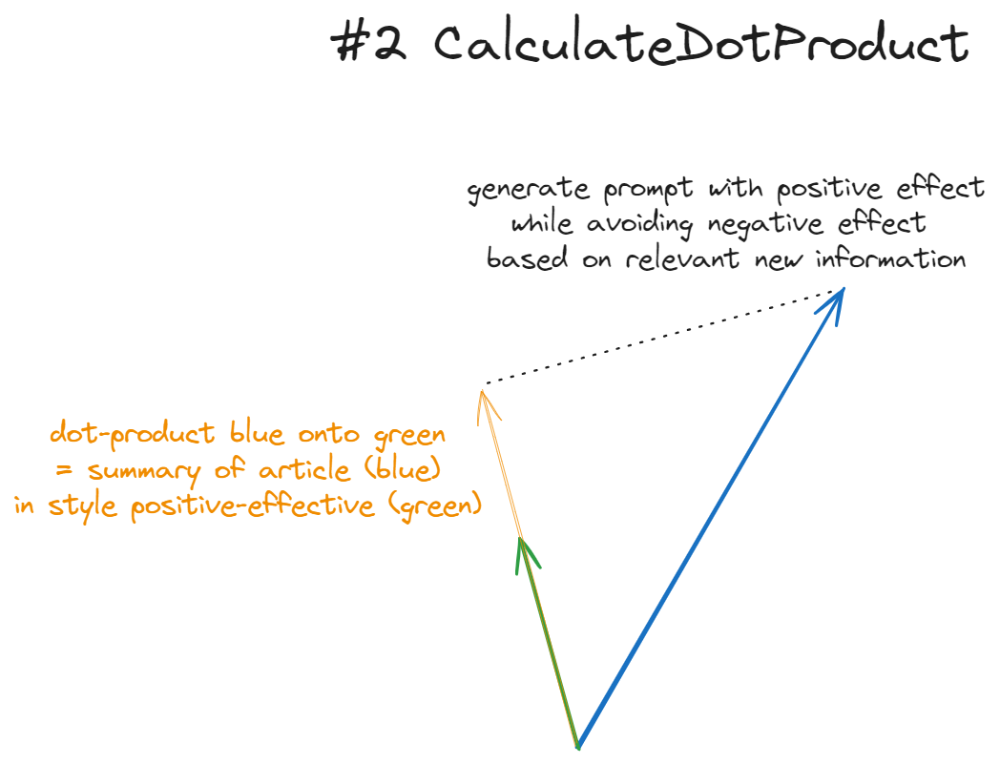
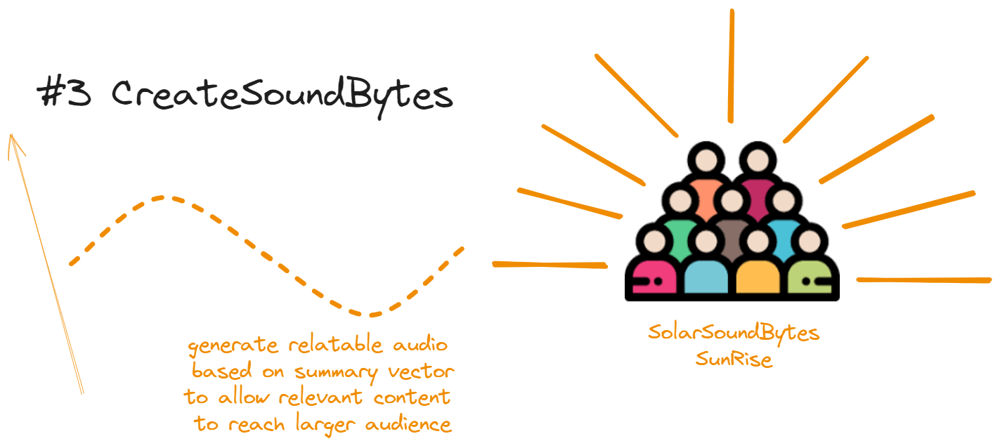

# SolarSoundBytes

## Table of Contents

- [Quick Overview](#quick-overview)
- [Key Features](#key-features)
- [Tech Stack](#tech-stack)
- [Getting Started](#getting-started)
- [Basic Usage](#basic-usage)
- [The Process](#the-process)
- [Datasets to use](#datasets-to-use)

_Mapping our global transition to solar energy into bite-sized audio insights._

**SolarSoundBytes** is a data-driven AI project that explores the connection
between **public sentiment** and **renewable energy development**, combining
**geospatial analysis, natural language processing, and audio generation.**

## Quick Overview

### 1. Analyze social media sentiment about solar energy



### 2. Map sentiment data against actual solar power production to find possible correlations



### 3. Use AI to predict how renewable energy production might change based on new

sentiment data. Create audio summaries to educate, engage and influence public
perception around renewable energy and sustainability (#social-engineering)



## Key Features

- Sentiment analysis of geo-tagged tweets
- Solar power production data correlation
- AI-powered audio summary generation
- Interactive data visualization

## Tech Stack

- Python 3.8+
- Natural Language Processing (HuggingFace)
- Audio Generation (Coqui TTS)
- Data Analysis (Pandas, NumPy)

## Getting Started

```bash
git clone https://github.com/YourUsername/SolarSoundBytes.git
cd SolarSoundBytes
pip install -r requirements.txt
```

## Basic Usage

```python
from solarsoundbytes.pipeline import SolarAnalyzer
analyzer = SolarAnalyzer()
analyzer.analyze_text("Sample text")
```

# The Process

The project begins by **analyzing public sentiment** on Twitter regarding
renewable energy topics, incorporating both geolocation and timestamp data for
each tweet. This allows us to map how opinions around clean energy evolve over
time and across different regions.


We then explore **potential correlations between changes in renewable energy
production and shifts in public sentiment**, focusing specifically on
environmental and spatial factors (even though economic and political variables
also play a role).


**If a correlation is found**, we take it a step further by **predicting how
renewable energy production might change** in the future, based on current
sentiment trends and environmental context.

These insights are used to generate **concise summaries**, combining the
sentiment analysis with relevant news articles. The summaries are transformed
into short, informative **audio clips—soundbytes—featuring natural voice
narration**.


These soundbytes are designed to educate, engage, and influence public
perception around renewable energy and sustainability.

# Datasets to use

**CNN-DailyMail News Text Summarization** (downloaded) - Use about 50K news
articles and summaries only. **Target:** highlights(summaries)

**Model:** BART - FINE TUNING NLP with LoRa
(https://huggingface.co/facebook/bart-large-cnn)
