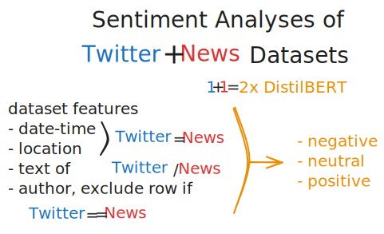
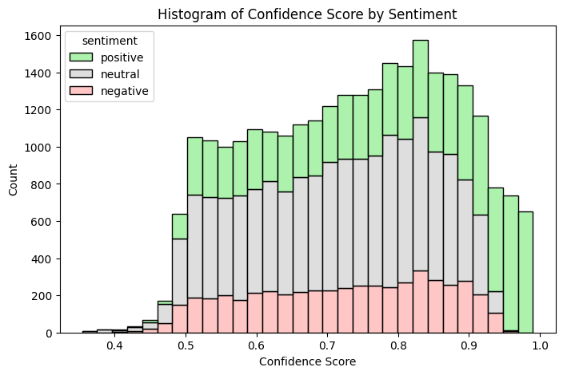
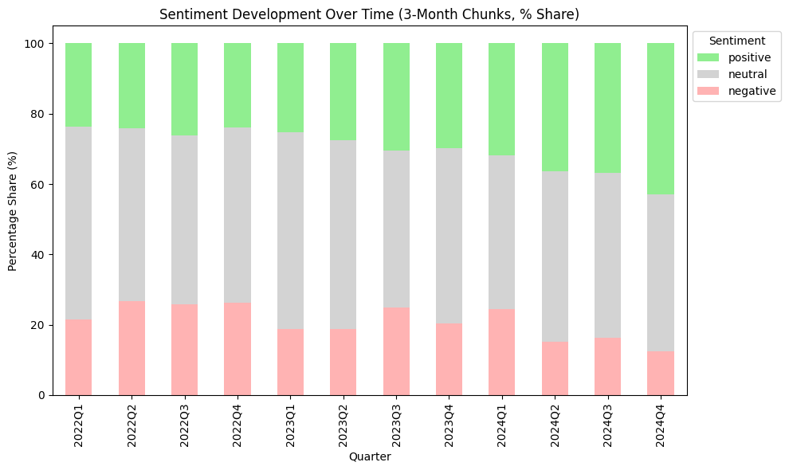
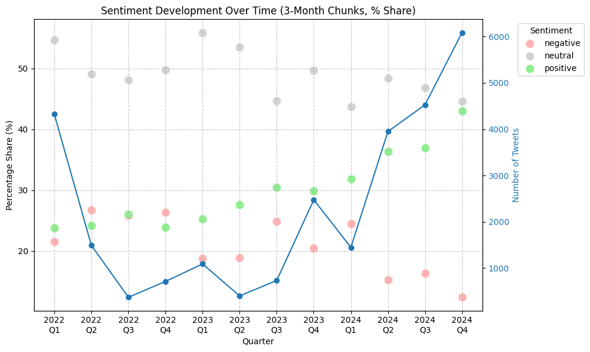

# Table of Contents

- [Project Overview](#solarsoundbytes)
- [MVP](#mvp)
- [Roles and Responsibilities](#roles-and-responsabilities)
- [Gather Data](#gather-data)
- [Process Data](#process-data)
- [Installation](#installation)
- [Glossary](#glossary)

# Project Overview

**SolarSoundBytes** is a data-driven machine-learning project that explores the
development of **renewable energy**, particularly solar, by:

1. NLP sentiment analysis of **public tweets** and

2. NLP sentiment analysis of **official news articles**.

These 2 sentiment analyses are compared to each other (to identify possible
correlations) and both mapped onto data on the development of renewable energy
technologies in the same timeframe.

## SoundBytes

To make our findings accessible and engaging, we transform the resulting
insights into concise audio summaries, aka **SoundBytes**, to effectively
communicate the state of our ongoing energy transition to a broader audience.

## Tagline

Mapping our global transition to solar energy into bite-sized audio insights.

# Website

The code presented in this repo is exposed online on the
[SolarSoundBytes Website](https://github.com/SL14-SL/solarsoundbytes-website).

# MVP

The initial MVP focuses on articles in the
[Cleantech Media Dataset by Anacode](https://www.kaggle.com/datasets/jannalipenkova/cleantech-media-dataset),
which span a time from 2022-01-02 to 2024-10-24.

To compare this official/academic dataset with the perception of the general
public, a twitter dataset was created by scraping xxx, covering the same time
frame.

# Beyond the MVP

To investigate a possible discrepancy between officially reported data and the
actually installed renewable energy generation capacity, we aim to supplement
the NLP sentiment analysis with solar panel and wind turbine detection using
satellite images (inspired by the
[SATLAS by Ai2](https://satlas.allen.ai/map?state={%22view%22:{%22longitude%22:-75.20284958000718,%22latitude%22:19.56034742358146,%22zoom%22:6.1407764029809515,%22pitch%22:0,%22bearing%22:0},%22showHeatmap%22:false,%22showAnimation%22:false,%22showSatellite%22:true,%22selectedDateOption%22:%222022-10%22,%22selectedDateOptionSecondary%22:%222016-08%22,%22selectedStartDateOption%22:%222016-07%22,%22selectedEndDateOption%22:%222022-12%22,%22selectedTreeCoverFill%22:[{%22label%22:%22None%22,%22isChecked%22:false},{%22label%22:%22Low%22,%22isChecked%22:false},{%22label%22:%22Medium%22,%22isChecked%22:true},{%22label%22:%22High%22,%22isChecked%22:true},{%22label%22:%22Full%22,%22isChecked%22:true}],%22selectedMarineInfra%22:[{%22label%22:%22Offshore%20Wind%20Turbines%22,%22isChecked%22:true},{%22label%22:%22Offshore%20Platforms%22,%22isChecked%22:false}],%22selectedRenewableEnergy%22:[{%22label%22:%22Solar%20Farms%22,%22isChecked%22:false},{%22label%22:%22Onshore%20Wind%20Turbines%22,%22isChecked%22:true}],%22selectedApplication%22:%22Renewable%20Energy%22,%22selectedLayout%22:%22Single%20Map%22})).

This would be an additional real-world application of the learnings acquired
during our
[bootcamp at Le Wagon](https://www.lewagon.com/barcelona/data-science-course).

# Roles and Responsabilities:

**[Fadri Pestalozzi](https://github.com/FadriPestalozzi)** – Team Leader

- Tweets on renewable energy: Research data sources, scraping and perform NLP
- Supervise documentation

**[Steffen Lauterbach](https://github.com/SL14-SL)** – System Architect

- Create model pipeline and docker container to expose API
- Research and process satellite images to detect and quantify solar panels
- Integrate TTS (text-to-sound)

**[Enrique Flores Roldán](https://github.com/EFRdev)** – Project Manager
- News Articles: Research data sources
- Create data processing pipeline, and tested models for NLP.
- Fine tune distilber model for sentiment analysis.

# Table of Contents

# Gather Data

## News Articles from Cleantech Media Dataset

Online research for datasets of news-articles in the field of renewable energy technologies led us to the
[Cleantech Media Dataset by Anacode](https://www.kaggle.com/datasets/jannalipenkova/cleantech-media-dataset).

  - 20K articles in total
  - Build a code for text processing: cleaning signs & digits, stopwords, lemmatize
      - 12,966 articles without a date. 2.5K Dates extracted from urls
      - **9,938** working articles (Europe only) (for MVP)

## **Training, Test & Evaluate**

- Tested different models for sentiment analysis.
    - [**distilbert-base-uncased-finetuned-sst-2-english**](https://huggingface.co/distilbert/distilbert-base-uncased-finetuned-sst-2-english) — Pos/Neg ONLY ***
    - [**cardiffnlp/twitter-roberta-base-sentiment-latest**](https://huggingface.co/cardiffnlp/twitter-roberta-base-sentiment-latest) — Pos/Neg/Netural
    - [**nlptown/bert-base-multilingual-uncased-sentiment**](https://huggingface.co/nlptown/bert-base-multilingual-uncased-sentiment) -- Optimized for reviews
    - [**Gemma 3**](https://huggingface.co/google/gemma-3-27b-it) — ***
- **First trial:** Very inaccurate — try again without too much preprocessing.
- **Second trial:** Still inaccurate — Analyse in sentences instead of entire article??? — divide data into chunks!
- **Third trial:** Still inaccurate — decided to fine tune a new model...

*****GEMMA - VertexAI**
- **Vertex AI SDK for Generative AI fine-tuning (Gemma models)** evolves very fast and the API keeps changing.
- Key methods like **fine_tune()** or **tune_model()** were either **missing, deprecated, or moved** to other parts of the library in different SDK versions.
- The **GenerativeModel.fine_tune()** method was not stable or consistently available, even after trying different setups (with Cloud Shell and pip installs).
- **Gemma is a chat / instruction-following model, not a task-specific model like DistilBERT or RoBERTa.**
- The new/recommended way to fine-tune Gemma now uses a **helper method** like aiplatform.model_garden.models.fine_tune_gemma(), which I started to implement but needed to refactore my code and so I decided to pivot.
- DIDN’T WORK —- MOVE ON!

## **Fine Tuning and Predict**

*****Recommended model = ["distilbert/distilbert-base-uncased](https://huggingface.co/distilbert/distilbert-base-uncased)"**

- Trained with labeled data and recommended model:
    - [***NewsArticles_ForTraining*](https://www.kaggle.com/datasets/clovisdalmolinvieira/news-sentiment-analysis) Dataset:**
        - Dataset for training (no topic in specific)
        - **3.5K** news articles - labeled
    - **model = "distilbert/distilbert-base-uncased"**
        - Fine tuned with 3.5K articles labeled: Pos/Neg/Neut
        - Run a 1st test and score was bad:
            - loss:0.627
            - accuracy 0.782
        - Tweaked the parameters and run a 2nd test
            - loss = 0.37
            - accuracy = 0.796

## Conclusion:

- Pre-trained sentiment models performed poorly on CleanTech news articles.
- Tried advanced models (DistilBERT, Twitter-RoBERTa, Gemma); accuracy remained low or workflow too complex.
- Fine-tuning Gemma on Vertex AI failed due to unstable SDK APIs and . Also, **Gemma 3** is optimised for chat / instruction-following.
- Pivoted to fine-tuning **DistilBERT-base** with 3.5K labeled articles.
- Achieved ~0.80 accuracy after tuning.
- Conclusion: **Domain-specific fine-tuning is required** for reliable sentiment analysis on niche topics like CleanTech.


## Social Media Data from Twitter

To compare the sentiment of news articles to a broader public sentiment, we
looked for a fitting twitter dataset.

Although
[the Climate Change Twitter Dataset](https://www.kaggle.com/datasets/deffro/the-climate-change-twitter-dataset)
(15 million tweets spanning over 13 years) looked promising at first, we could
not use it due to the lack of full-text tweets within.

Since the
[vast majority](#futile-rehydration-attempt-of-climate-change-twitter-dataset)
of the most recent tweet_ids listed inside
[the Climate Change Twitter Dataset](https://www.kaggle.com/datasets/deffro/the-climate-change-twitter-dataset)
in GBR are no longer accessible, we abandoned our attempt to rehydrate this
dataset.

After extensive and unsuccessful further research for an alternative twitter
dataset, we decided to create our own twitter dataset as input for a social
media sentiment analysis using a
[scraping actor](https://console.apify.com/actors/CJdippxWmn9uRfooo) on
[console.apify](https://console.apify.com/).

As a tradeoff between scraping cost, time and scraping-content, a sampling
frequency of 1 day per month was chosen, applying an
[actor-specific](https://console.apify.com/actors/CJdippxWmn9uRfooo) format of
[scraping input parameters](scraping/template-params.json).

### Rehydration of Climate Change Twitter Dataset

To test rehydration of
[the Climate Change Twitter Dataset](https://www.kaggle.com/datasets/deffro/the-climate-change-twitter-dataset),
a tweet-subset of 557,125 tweets with geolocation coordinates inside GBR was
selected.

Rehydration was performed in chunks of up to 10k tweets. As shown in below
table, the lack of data renders this rehydration attempt pointless.

| range of GBR-tweet-numbers of tweet_ids in scraping-chunk | number of successful rehydrations | rehydration percentage of tweet chunk |
| --------------------------------------------------------- | --------------------------------- | ------------------------------------- |
| 550,000 – 557,125                                         | 1                                 | 0.013%                                |
| 540,000 – 549,999                                         | 5                                 | 0.050%                                |
| 530,000 – 539,999                                         | 11                                | 0.110%                                |

### Scraping Twitter Dataset

To compile a twitter dataset covering the same topics as covered by the
[Cleantech Media Dataset](https://www.kaggle.com/datasets/jannalipenkova/cleantech-media-dataset),
the
[unique values in the cleantech "domains" column](preprocessing/scraping/cleantech_articles__unique_domains.txt)
are used as search terms for scraping with the chosen
[twitter scraper](https://console.apify.com/actors/CJdippxWmn9uRfooo).

To work with a user-friendly scraping GUI while keeping scraping costs below 40
USD/month, the following scraper was chosen:

- [Tweet Scraper|$0.25/1K Tweets | Pay-Per Result | No Rate Limits](https://console.apify.com/actors/CJdippxWmn9uRfooo/input?addFromActorId=CJdippxWmn9uRfooo).

Unfortunately, this chosen scraping method was unable to handle more than 2
search terms simultaneously.

Therefore, the
[initial list of search terms](preprocessing/scraping/cleantech_articles__unique_domains.txt)
was replaced with just 2 overarching [search terms](#search-terms) to generate a
twitter dataset with as large of a contextual overlap as possible with the
[Cleantech Media Dataset by Anacode](https://www.kaggle.com/datasets/jannalipenkova/cleantech-media-dataset).

### Search Terms

- renewable energy
- energy storage

# Process Data

## Sentiment Analysis

### Methods



### Results

#### histogram confidence score vs sentiment color



#### sentiment score share over time



#### sentiment score share vs number of tweets over time



# Installation

## clone this repo to your computer

```shell
cd /path/to/your/project-parent-folder

git clone <paste_your_SSH_link_here>
```

## create virtual environment using python version according to [Le Wagon](https://www.lewagon.com/barcelona/data-science-course)

Separate local development environment from your global python environment to
define specific packages and versions.

```shell
# go to the project-folder
cd /path/to/SolarSoundBytes

pyenv virtualenv 3.10.6 SolarSoundBytes
```

## activate virtual environment in cloned repo

```shell
pyenv local SolarSoundBytes
```

## Install minimal packages

```shell
pip install --upgrade pip
pip install -r https://gist.githubusercontent.com/krokrob/53ab953bbec16c96b9938fcaebf2b199/raw/9035bbf12922840905ef1fbbabc459dc565b79a3/minimal_requirements.txt
pip list
```

## install requirements

```shell
pip install -r requirements.txt
```

## create data folder (untracked by .gitignore) and request data access from one of the authors

```shell
touch data
```

# Glossary

- **API**: Application Programming Interface – a set of rules that allows
  different software applications to communicate with each other.
- **GBR**: Great Britain
- **GUI**: Graphical User Interface – a visual way of interacting with a
  computer using items like windows, icons, and buttons.
- **MVP**: Minimum Viable Product – the simplest version of a product that can
  be released to test a new business idea and gather user feedback.
- **NLP**: Natural Language Processing – a field of artificial intelligence
  focused on the interaction between computers and human language.
- **PV**: Photovoltaic – technology that converts sunlight directly into
  electricity using solar cells.
- **TTS**: Text-to-Speech – technology that converts written text into spoken
  voice output.
- **USD**: United States Dollar
