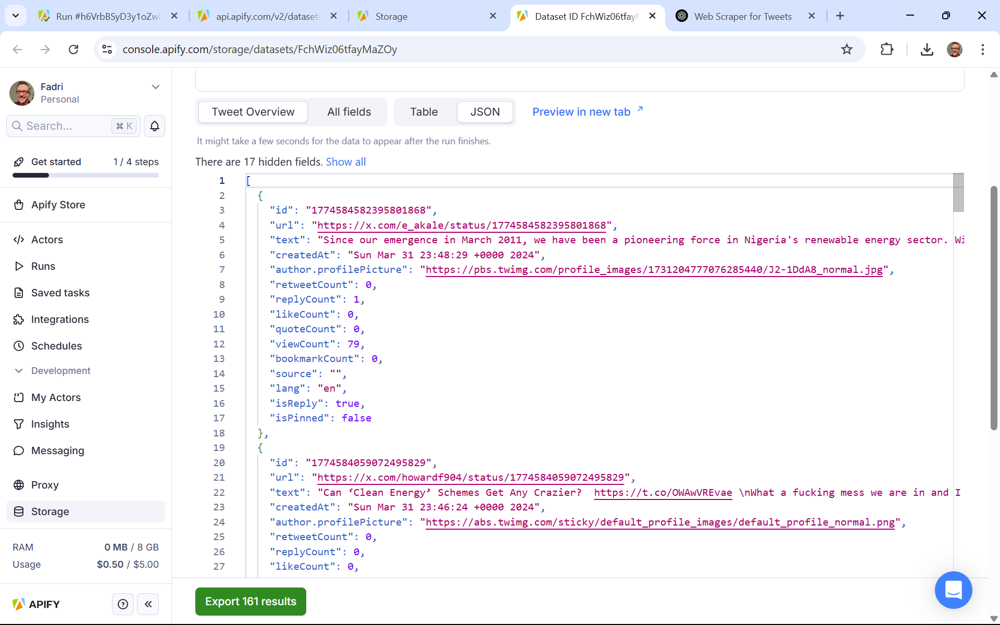

# Table of Contents

- [Project Overview](#solarsoundbytes)
- [MVP](#mvp)
- [Roles and Responsibilities](#roles-and-responsabilities)
- [Gather Data](#gather-data)
- [Process Data](#process-data)
- [Installation](#installation)
- [Glossary](#glossary)

# Project Overview

**SolarSoundBytes** is a data-driven machine-learning project that explores the
development of **renewable energy**, particularly solar, by:

1. NLP sentiment analysis of **public tweets** and

2. NLP sentiment analysis of **official news articles**.

These 2 sentiment analyses are compared to each other (to identify possible
correlations) and both mapped onto data on the development of renewable energy
technologies in the same timeframe.

## SoundBytes

To make our findings accessible and engaging, we transform the resulting
insights into concise audio summaries, aka **SoundBytes**, to effectively
communicate the state of our ongoing energy transition to a broader audience.

## Tagline

Mapping our global transition to solar energy into bite-sized audio insights.

# Website

The code presented in this repo is exposed online on the
[SolarSoundBytes Website](https://github.com/SL14-SL/solarsoundbytes-website).

# MVP

The initial MVP focuses on articles in the
[Cleantech Media Dataset by Anacode](https://www.kaggle.com/datasets/jannalipenkova/cleantech-media-dataset),
which span a time from 2022-01-02 to 2024-10-24.

To compare this official/academic dataset with the perception of the general
public, a twitter dataset was scraped, covering the same time frame.

## Scraping Twitter Dataset

To compile a twitter dataset covering the same topics as covered by the
cleantech articles dataset, unique values in the cleantech "domains" column (see
[`unique_domains.txt`](preprocessing/scraping/cleantech_articles__unique_domains.txt))
are used as search terms for scraping with a twitter scraper on
[console.apify](https://console.apify.com/).

To keep scraping costs below a standard monthly membership of 39 USD, the
following scraper was chosen:

- [Tweet Scraper|$0.25/1K Tweets | Pay-Per Result | No Rate Limits](https://console.apify.com/actors/CJdippxWmn9uRfooo/input?addFromActorId=CJdippxWmn9uRfooo).

### unique values in the cleantech "domains" column

Unfortunately, the chosen scraping method was unable to handle more than 2
search terms simultaneously.

To Therefore the following 2 search terms were chosen to generate a twitter
dataset for the same topics as contained in the cleantech dataset.

### Search Terms

- renewable energy
- energy storage

# Beyond the MVP

To investigate a possible discrepancy between officially reported data and the
actually installed solar PV, we aim to supplement the NLP sentiment analysis
with solar panel detection using satellite images.

This would be an additional real-world application of the learnings acquired
during our
[bootcamp at Le Wagon](https://www.lewagon.com/barcelona/data-science-course).

# Roles and Responsabilities:

**[Fadri Pestalozzi](https://github.com/FadriPestalozzi)** – Team Leader

- Tweets on renewable energy: Research data sources, scraping and perform NLP
- Supervise documentation

**[Steffen Lauterbach](https://github.com/SL14-SL)** – System Architect

- Create model pipeline and docker container to expose API
- Research and process satellite images to detect and quantify solar panels

**[Enrique Flores Roldán](https://github.com/EFRdev)** – Project Manager

- News Articles: Research data sources and perform NLP
- Integrate TTS (text-to-sound)

# Table of Contents

# Gather Data

## Twitter scraping with console.apify

- [scraping actor](https://console.apify.com/actors/CJdippxWmn9uRfooo/input)
- [stored datasets](https://console.apify.com/storage/datasets)
- [Renewable Energy Search Terms](scraping/renewable-energy-search-terms.md) are
  gathered using [butter](https://app.butter.us/)
- See [`scraping/template-params.json`](scraping/template-params.json) for
  sample input parameters to scrape a target month.

### GUI



### data features

- id
- url
- text
- createdAt
- author.profilePicture
- retweetCount
- replyCount
- likeCount
- quoteCount
- viewCount
- bookmarkCount
- source
- lang
- isReply
- isRetweet
- isQuote
- isPinned

## check data sources to correlate satellite images with solar production

- [solar panel detection from space](https://universe.roboflow.com/search?q=solar%2520panel+object+detection)

## correlate time series of sentiment analysis with renewable energylegal)

# Process Data

## Sentiment Analysis

### Methods


### Results

#### histogram confidence score vs sentiment color


#### sentiment score share over time


#### sentiment score share vs number of tweets over time


# Installation

## clone this repo to your computer

```shell
cd /path/to/your/project-parent-folder

git clone <paste_your_SSH_link_here>
```

## create virtual environment using python version according to [Le Wagon](https://www.lewagon.com/barcelona/data-science-course)

Separate local development environment from your global python environment to
define specific packages and versions.

```shell
# go to the project-folder
cd /path/to/SolarSoundBytes

pyenv virtualenv 3.10.6 SolarSoundBytes
```

## activate virtual environment in cloned repo

```shell
pyenv local SolarSoundBytes
```

## Install minimal packages

```shell
pip install --upgrade pip
pip install -r https://gist.githubusercontent.com/krokrob/53ab953bbec16c96b9938fcaebf2b199/raw/9035bbf12922840905ef1fbbabc459dc565b79a3/minimal_requirements.txt
pip list
```

## install requirements

```shell
pip install -r requirements.txt
```

## create data folder, untracked by .gitignore

```shell
touch data
```

# Glossary

- **API**: Application Programming Interface – a set of rules that allows
  different software applications to communicate with each other.
- **GUI**: Graphical User Interface – a visual way of interacting with a
  computer using items like windows, icons, and buttons.
- **MVP**: Minimum Viable Product – the simplest version of a product that can
  be released to test a new business idea and gather user feedback.
- **NLP**: Natural Language Processing – a field of artificial intelligence
  focused on the interaction between computers and human language.
- **PV**: Photovoltaic – technology that converts sunlight directly into
  electricity using solar cells.
- **TTS**: Text-to-Speech – technology that converts written text into spoken
  voice output.
- **USD**: United States Dollar
