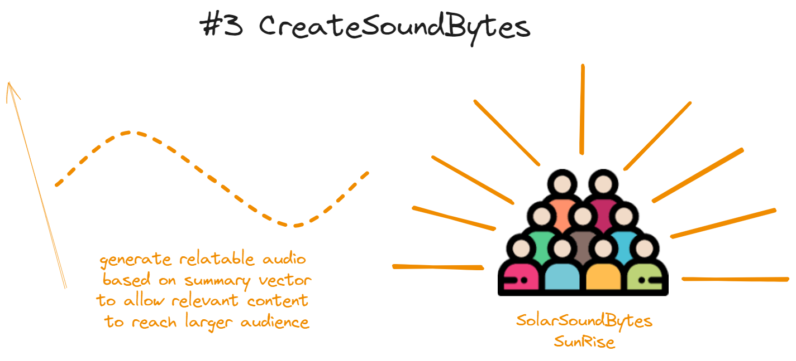

# SolarSoundBytes

Mapping our global transition to solar energy into bite-sized audio insights.

**SolarSoundBytes** is a data-driven AI project that explores the relationship between **renewable energy development**, as observed through satellite imagery, **public sentiment**, and **official news articles**, focusing initially in United Kingdom, with plans to expand globally upon successful completion of the MVP.

This approach will help uncover potential influences of political, economic, or social factors on the adoption and perception of solar energy.

To make our findings accessible and engaging, we transform these insights into concise audio summaries, **soundbites**, that effectively communicate the state of the energy transition to a broader audience.

# Roles and Responsabilities:
**Fadri Pestalozz**i** - Team leader
- Scrapping Data
- NLP - Tweeter Data
- Documentation Supervisor

**Steffen Lauterbach**
- System Architect (code efficiency)
- Data Researcher - satelite images
- Proces images for detection of solar pannels

**Enrique Flores Roldán**
- Project Manager
- NLP - News Articles
- TTS integration

# Table of Contents

# Data

## twitter scraping with console.apify

- [scraping actor](https://console.apify.com/actors/CJdippxWmn9uRfooo/input)
- [stored datasets](https://console.apify.com/storage/datasets)
- See [`scraping/template-params.json`](scraping/template-params.json) for
  sample input parameters to scrape a target month.

### GUI


### data features

- id
- url
- text
- createdAt
- author.profilePicture
- retweetCount
- replyCount
- likeCount
- quoteCount
- viewCount
- bookmarkCount
- source
- lang
- isReply
- isRetweet
- isQuote
- isPinned

## check data sources to correlate satellite images with solar production

- [solar panel detection from space](https://universe.roboflow.com/search?q=solar%2520panel+object+detection)

## correlate sentiment evolution with framework conditions (technological, legal)

# setup

## clone this repo to your computer

```shell
cd /path/to/your/project-parent-folder

git clone <paste_your_SSH_link_here>
```

## create virtual environment

Separate local development environment from your global python environment to
define specific packages and versions

```shell
# go to the project-folder
cd /path/to/SolarSoundBytes

pyenv virtualenv 3.12.9 SolarSoundBytes
```

## activate virtual environment in cloned repo

```shell
pyenv local SolarSoundBytes
```

## create hidden data folder (untracked by .gitignore)

```shell
touch .data
```


<!--
# Quick Overview

## 1. Analyze social media sentiment about solar energy


## 2. Map sentiment data against actual solar power production to find possible correlations


## 3. Use AI to predict how renewable energy production might change based on new

sentiment data. Create audio summaries to educate, engage and influence public
perception around renewable energy and sustainability (#social-engineering)



# Key Features

- Sentiment analysis of geo-tagged tweets
- Solar power production data correlation
- AI-powered audio summary generation
- Interactive data visualization

# Tech Stack

- Python 3.8+
- Natural Language Processing (HuggingFace)
- Audio Generation (Coqui TTS)
- Data Analysis (Pandas, NumPy)

# Getting Started

```bash
git clone https://github.com/YourUsername/SolarSoundBytes.git
cd SolarSoundBytes
pip install -r requirements.txt
```

# Basic Usage

```python
from solarsoundbytes.pipeline import SolarAnalyzer
analyzer = SolarAnalyzer()
analyzer.analyze_text("Sample text")
```

# The Process

The project begins by **analyzing public sentiment** on Twitter regarding
renewable energy topics, incorporating both geolocation and timestamp data for
each tweet. This allows us to map how opinions around clean energy evolve over
time and across different regions.


We then explore **potential correlations between changes in renewable energy
production and shifts in public sentiment**, focusing specifically on
environmental and spatial factors (even though economic and political variables
also play a role).


**If a correlation is found**, we take it a step further by **predicting how
renewable energy production might change** in the future, based on current
sentiment trends and environmental context.

These insights are used to generate **concise summaries**, combining the
sentiment analysis with relevant news articles. The summaries are transformed
into short, informative **audio clips—soundbytes—featuring natural voice
narration**.


These soundbytes are designed to educate, engage, and influence public
perception around renewable energy and sustainability.

# Datasets to use

**CNN-DailyMail News Text Summarization** (downloaded) - Use about 50K news
articles and summaries only. **Target:** highlights(summaries)

**Model:** BART - FINE TUNING NLP with LoRa
(https://huggingface.co/facebook/bart-large-cnn) -->
